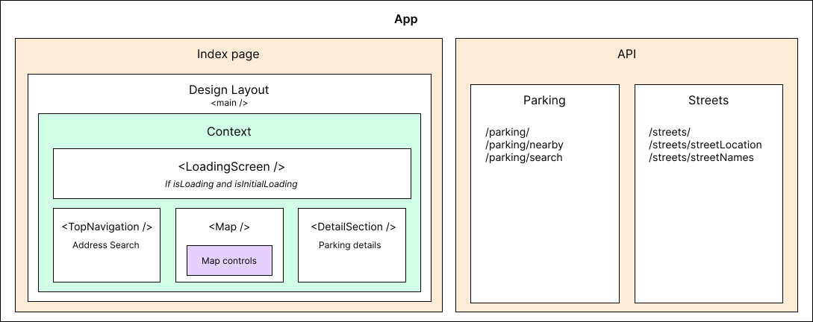

<div id="top"></div>

<!-- PROJECT LOGO -->
<br />
<div align="center">
  <a href="https://github.com/1Tolv2/sthlm-mc-parking-pwa">
    
  </a>

<h3 align="center">STHLM MC Parking</h3>

  <p align="center">
    A progressive web app written in TypeScript with Next.js
    <br />
    <a href="https://github.com/1Tolv2/sthlm-mc-parking-pwa"><strong>Explore the docs »</strong></a>
    <br />
    <br />
    <a href="https://github.com/1Tolv2/sthlm-mc-parking-pwa/issues">Propose Feature</a>
	  ·
    <a href="https://github.com/1Tolv2/sthlm-mc-parking-pwa/issues">Report Bug</a>
  </p>
</div>

<!-- ABOUT THE PROJECT -->
# About The Project

This application lets you search or use your current location to find parking spots in the Stockholm City area. It utilises the local traffic offices road database through the Open Stockholm API to get all registered locations of motorcycle parking spots.
To display the map and location markers, the google Maps JavaScript API is used.

## Built with
* [](https://www.typescriptlang.org/)
* [](https://nextjs.org/)

<!-- GETTING STARTED -->
# Getting Started

To setup a local copy follow the steps below

## Prerequisites

* NPM - https://nodejs.org/en/download/

## Installation
 
1. First start cloning the repo by entering the below command in your terminal.
   ```sh
   git clone https://github.com/1Tolv2/sthlm-mc-parking-pwa-typescript.git
   ```
2. After cloning the repository, cd in to the new folder and install.
   ```sh
   npm install
   ```
3. Set up your env variables
You need to get 2 keys
- A google maps JavaScript API key at: https://console.cloud.google.com/
- A Open Stockholm key at: https://openstreetgs.stockholm.se/Home/News

Rename the `./.env.example` file to `.env` and fill out the empty variables with your keys

## Run the app
### Localhost
Start up the application by running the below command when standing in the root of the repository folder.
```sh
npm run dev
```

After starting your app you can open <a href="http://localhost:3000/">http://localhost:3000/</a> in the browser.
The page reloads as you make changes and save your code.


# Documentation
This documentation is created for developers on the existing project but may give some insight if you are setting it up on your own.

This project is setup by using `create-next-app --typescript`, to read more about this setup process see [Next.js "Getting started" documentation](https://nextjs.org/docs/getting-started).
## Scripts
To run scripts you can write `npm run <SCRIPT>`, e.g `npm run dev`
- `dev` - Runs `next dev` to start Next.js in development mode
- `build` - Runs `next build` to build the application for production usage
- `start` - Runs `next start` to start a Next.js production server
- `lint` - Runs `next lint` to set up Next.js' built-in ESLint configuration

## Application structure
This is a one page application so all the components are rendered from the index page, `./pages/index`.

In the index page the main structure is prepared
- `<Layout />` encapsulates the app which contains `<main />`.
- `<AppProvider />` contains all the context for the application so all content is rendered as it's child. 
- `<Content />` renders every component.

The application utilises the next api to provide security for the api keys aswell as get around CORS on the Stockholm Open APIs.

This is a diagram of the application structure.


### `./context`
All context providers are rendered through `./context/index`.

The following are provided:
- `AppContext` - Application loading states.
- `ModalContext` - State of the modal content and renders the modal.
- `ParkingContext` - Parkingspot aswell as location states and a reset function to reset to all parkingspots.
- `MapContext` - Map setting states and a reset function to reset map to initial center position.

### `./components`
All components are found in the `./components` folder, the main components are found in it's root, eg. `<MapNavigation />` and `<TopNavigation />`, the rest are in `./library`.


Components in the library folder are grouped based on similarity, like `/library/buttons`, or on relation like `/library/map` which contains `<Map />` that renders `<ParkingLocations />` which is a one-time-use-component but they are split up to help with readability.

#### **Basic reusable components**

- `<StandardContainer />` - This is a container for free floating components on top of the map.
- `<Icons />` - To dynamically render icons, add icon here to the icons object.
- `<Modal />` - This is a container for prompt or information that should grab the users attention.
- `<LoadingModal />` - Whenever data is being fetched, this should be shown to inform the user, it triggers by setting `isLoading` to `true`.

In the components folder you'll also find `api.ts` which is where all the calls to the api are gathered to be able to be reused.

### `./types`
All custom types are found here. Import them through the index, like so:
```javascript
import { FeatureItem } from "../types";
```

### `./utils`
Reused function and other utilities are kept in `./utils`.
- `getHexColor` - converts the tailwind color classes to hex code, eg. used for icon colors.
- `getParkingRates` - contains all the parking rates and should be updated on changes.

### `./pages`
Contains the pages and the next api.

Link to the [API docs](https://github.com/1Tolv2/sthlm-mc-parking-pwa/blob/main/pages/api/README.md)

## Code rules
This application uses the following to enforce code rules and 
- ESLint - Lints code to find errors [ESLint docs](https://eslint.org/docs/latest/)
    ```sh
    npm run lint 
    #  Lints all files
    ```
- Prettier - Code formatter, [Prettier docs](https://prettier.io/docs/en/)
    ```sh
    npx prettier -c <file/dir/glob>
    #  Checks if files follow the format
    ```

## CI/CD
### Deployment
The application is deployed to [Vercel](https://vercel.com/docs). It redeploys when pushes are made to github. 

*The application will only work on localhost:3000 and the main vercel domain due to the google API key being restricted, this will be fixed upon release so that there is a dev key.*

### Tests
There aren't currently any tests on the application but testing libraries are pre-installed with `create-next-app`

### Useful CLI commands

Deploy a project when standing in the root.
```sh
vercel
```
Link local directory to a Vercel project
```sh
vercel link
```
To download all environment variables from an existing deployment
```sh
vercel env pull
```

## UI
This project utilises the [Tailwind CSS](https://v2.tailwindcss.com/docs) framework to style the application.

Colors and spacings have been changed to custom ones, check `./tailwind.config.js` where configurations are made.

In `./styles/global.css` you'll find custom classes added to tailwind.
- `.font-tratex` - custom added font that is the official road sign font in Sweden. [Link to the font](https://www.transportstyrelsen.se/sv/vagtrafik/Trafikregler/Om-vagmarken/Teckensnitt/).